# Travel Planning: AMQP Agent Messaging Scenario

## Overview

This scenario demonstrates asynchronous message exchange patterns between
distributed agents using AMQP. It implements a travel planning system with six
independent agents that communicate through message queues to coordinate trip
planning requests.

Each of these agents could be implemented in a deterministic way or with help of
an LLM.

A formal description of the scenario, which leans in great parts on the [CNCF
xRegistry](xregistry.io) metadata framework for endpoints, messages, and
schemas, resides at [travel-topology.json](travel-topology.json)

## Agent Architecture

- **[TravelPlannerService](cs/Agents/TravelPlannerService.cs)**: Orchestrator that receives requests and coordinates
  specialist agents
- **[AirTravelAgent](cs/Agents/AirTravelAgent.cs)**: Handles flight search requests and refinements
- **[TrainTravelAgent](cs/Agents/TrainTravelAgent.cs)**: Processes rail travel queries
- **[RoadTravelAgent](cs/Agents/RoadTravelAgent.cs)**: Manages bus and road travel options
- **[AccommodationAgent](cs/Agents/AccommodationAgent.cs)**: Handles lodging requests
- **[RentalCarAgent](cs/Agents/RentalCarAgent.cs)**: Processes vehicle rental requests

## AMQP Message Flow

### Message Exchange Pattern

The system demonstrates a **Request-Proposal-Refinement** pattern:

1. **Request Phase**: Orchestrator sends parallel requests to specialist agents
2. **Proposal Phase**: Agents respond with initial proposals
3. **Refinement Phase**: Orchestrator requests improvements based on constraints
4. **Iterative**: Steps 2-3 repeat until satisfactory solutions are found

The following is a Mermaid sequence diagram of the scenario.

```mermaid
sequenceDiagram
    participant Customer
    participant customerReplyChannel as 📥 customerReplyChannel
    participant travel_requests as 📥 travel.requests
    participant TravelPlannerService
    participant travel_proposals as 📥 travel.proposals
    participant air_travel as 📤 air.travel
    participant air_refine as 📤 air.refine
    participant train_travel as 📤 train.travel
    participant train_refine as 📤 train.refine
    participant road_travel as 📤 road.travel
    participant road_refine as 📤 road.refine
    participant accommodations as 📤 accommodations
    participant accommodation_refine as 📤 accommodation.refine
    participant rental_cars as 📤 rental.cars
    participant rentalcar_refine as 📤 rentalcar.refine
    participant AirTravelAgent
    participant TrainTravelAgent
    participant RoadTravelAgent
    participant AccommodationAgent
    participant RentalCarAgent    
    
    Note over Customer: Customer requests travel plan
    Customer->>travel_requests: CloudEvent(com.contoso.travel.TravelRequest)
    travel_requests->>TravelPlannerService: CloudEvent(com.contoso.travel.TravelRequest)
    
    par Initial Expert Consultations (REQUEST)
        TravelPlannerService->>air_travel: CloudEvent(com.contoso.travel.FlightSearchRequest)
        air_travel->>AirTravelAgent: CloudEvent(com.contoso.travel.FlightSearchRequest)
        and
        TravelPlannerService->>train_travel: CloudEvent(com.contoso.travel.TrainSearchRequest)
        train_travel->>TrainTravelAgent: CloudEvent(com.contoso.travel.TrainSearchRequest)
        and
        TravelPlannerService->>road_travel: CloudEvent(com.contoso.travel.RoadTravelRequest)
        road_travel->>RoadTravelAgent: CloudEvent(com.contoso.travel.RoadTravelRequest)
        and
        TravelPlannerService->>accommodations: CloudEvent(com.contoso.travel.AccommodationRequest)
        accommodations->>AccommodationAgent: CloudEvent(com.contoso.travel.AccommodationRequest)
        and
        TravelPlannerService->>rental_cars: CloudEvent(com.contoso.travel.RentalCarRequest)
        rental_cars->>RentalCarAgent: CloudEvent(com.contoso.travel.RentalCarRequest)
    end
    
    par Initial Proposals (PROPOSE)
        AirTravelAgent->>travel_proposals: CloudEvent(com.contoso.travel.TravelProposal)
        travel_proposals->>TravelPlannerService: CloudEvent(com.contoso.travel.TravelProposal)
        and
        TrainTravelAgent->>travel_proposals: CloudEvent(com.contoso.travel.TravelProposal)
        travel_proposals->>TravelPlannerService: CloudEvent(com.contoso.travel.TravelProposal)
        and
        RoadTravelAgent->>travel_proposals: CloudEvent(com.contoso.travel.TravelProposal)
        travel_proposals->>TravelPlannerService: CloudEvent(com.contoso.travel.TravelProposal)
        and
        AccommodationAgent->>travel_proposals: CloudEvent(com.contoso.travel.TravelProposal)
        travel_proposals->>TravelPlannerService: CloudEvent(com.contoso.travel.TravelProposal)
        and
        RentalCarAgent->>travel_proposals: CloudEvent(com.contoso.travel.TravelProposal)
        travel_proposals->>TravelPlannerService: CloudEvent(com.contoso.travel.TravelProposal)
    end
    
    Note over TravelPlannerService: Analyzes proposals vs budget/preferences
    
    par Refinement Requests (REFINE) - Round 1
        TravelPlannerService->>air_refine: CloudEvent(com.contoso.travel.RefinementRequest)("budget")
        air_refine->>AirTravelAgent: CloudEvent(com.contoso.travel.RefinementRequest)
        and
        TravelPlannerService->>accommodation_refine: CloudEvent(com.contoso.travel.RefinementRequest)("budget")
        accommodation_refine->>AccommodationAgent: CloudEvent(com.contoso.travel.RefinementRequest)
    end
    
    par Refined Proposals (PROPOSE) - Round 1
        AirTravelAgent->>travel_proposals: CloudEvent(com.contoso.travel.TravelProposal) (refined)
        travel_proposals->>TravelPlannerService: CloudEvent(com.contoso.travel.TravelProposal) (refined)
        and
        AccommodationAgent->>travel_proposals: CloudEvent(com.contoso.travel.TravelProposal) (refined)
        travel_proposals->>TravelPlannerService: CloudEvent(com.contoso.travel.TravelProposal) (refined)
    end
    
    Note over TravelPlannerService: Re-evaluates refined proposals
    Note over TravelPlannerService: [Optional: Additional refinement cycles]
    Note over TravelPlannerService: REFINE → PROPOSE can repeat *n times
    
    opt Additional Refinement (REFINE) - Round 2
        TravelPlannerService->>air_refine: CloudEvent(com.contoso.travel.RefinementRequest)("flexibility")
        air_refine->>AirTravelAgent: CloudEvent(com.contoso.travel.RefinementRequest)
        AirTravelAgent->>travel_proposals: CloudEvent(com.contoso.travel.TravelProposal) (further refined)
        travel_proposals->>TravelPlannerService: CloudEvent(com.contoso.travel.TravelProposal) (further refined)
    end
    
    Note over TravelPlannerService: Synthesizes final plan
    TravelPlannerService->>customerReplyChannel: TravelPlan
    customerReplyChannel->>Customer: TravelPlan
```

### Sequence Diagram

## AMQP Queue Configuration

### Queue Bindings

**TravelPlannerService**:

- Binds to: `travel.requests` (receives travel planning requests)
- Binds to: `travel.proposals` (receives expert agent proposals)
- Sends to: `air.travel`, `train.travel`, `road.travel`, `accommodations`,
  `rental.cars` (initial requests)
- Sends to: `air.refine`, `train.refine`, `road.refine`, `accommodation.refine`,
  `rentalcar.refine` (refinement requests)
- Sends to: `customerReplyChannel` (final travel plans)

**Specialist Agents**:

- **AirTravelAgent**: Binds to `air.travel` & `air.refine`, sends to
  `travel.proposals`
- **TrainTravelAgent**: Binds to `train.travel` & `train.refine`, sends to
  `travel.proposals`
- **RoadTravelAgent**: Binds to `road.travel` & `road.refine`, sends to
  `travel.proposals`
- **AccommodationAgent**: Binds to `accommodations` & `accommodation.refine`,
  sends to `travel.proposals`
- **RentalCarAgent**: Binds to `rental.cars` & `rentalcar.refine`, sends to
  `travel.proposals`

## Message Schema

### Message Types

**Request Messages**:

- `travel.requests` → CloudEvent type: `com.contoso.travel.TravelRequest`
  - Data: `TravelRequest(TripId, CustomerId, Origin, Destination, Dates, Preferences, Budget, CustomerEmail)`
- `air.travel` → CloudEvent type: `com.contoso.travel.FlightSearchRequest`
  - Data: `FlightSearchRequest(TripId, Origin, Destination, DepartDate, ReturnDate, Passengers)`
- `train.travel` → CloudEvent type: `com.contoso.travel.TrainSearchRequest`
  - Data: `TrainSearchRequest(TripId, Origin, Destination, DepartDate, ReturnDate, Passengers)`
- `road.travel` → CloudEvent type: `com.contoso.travel.RoadTravelRequest`
  - Data: `RoadTravelRequest(TripId, Origin, Destination, DepartDate, ReturnDate, TravelType)`
- `accommodations` → CloudEvent type: `com.contoso.travel.AccommodationRequest`
  - Data: `AccommodationRequest(TripId, Location, CheckIn, CheckOut, Guests, Preferences)`
- `rental.cars` → CloudEvent type: `com.contoso.travel.RentalCarRequest`
  - Data: `RentalCarRequest(TripId, Location, PickupDate, ReturnDate, VehicleType)`

**Response Messages**:

- `travel.proposals` → CloudEvent type: `com.contoso.travel.TravelProposal`
  - Data: `TravelProposal(TripId, AgentType, AgentId, Options[], EstimatedCost, Confidence)`

**Refinement Messages**:

- `air.refine` → CloudEvent type: `com.contoso.travel.RefinementRequest`
  - Data: `RefinementRequest(TripId, TargetAgentType, OriginalProposalId, FeedbackType, Feedback, Priority, RequestedBy)`
- `train.refine` → CloudEvent type: `com.contoso.travel.RefinementRequest`
  - Data: `RefinementRequest(TripId, TargetAgentType, OriginalProposalId, FeedbackType, Feedback, Priority, RequestedBy)`
- `road.refine` → CloudEvent type: `com.contoso.travel.RefinementRequest`
  - Data: `RefinementRequest(TripId, TargetAgentType, OriginalProposalId, FeedbackType, Feedback, Priority, RequestedBy)`
- `accommodation.refine` → CloudEvent type: `com.contoso.travel.RefinementRequest`
  - Data: `RefinementRequest(TripId, TargetAgentType, OriginalProposalId, FeedbackType, Feedback, Priority, RequestedBy)`
- `rentalcar.refine` → CloudEvent type: `com.contoso.travel.RefinementRequest`
  - Data: `RefinementRequest(TripId, TargetAgentType, OriginalProposalId, FeedbackType, Feedback, Priority, RequestedBy)`

**Event Messages**:

- `travel.events` → CloudEvent type: `com.contoso.travel.TravelEvent`
  - Data: `TravelEvent(TripId, EventType, AgentType, AgentId, EventData, CorrelationId, ParentEventId)`

**Notification Messages**:

- `travel.notifications` → CloudEvent type: `com.contoso.travel.TravelNotification`
  - Data: `TravelNotification(TripId, CustomerId, CustomerEmail, NotificationType, MessageType, Subject, Content, Priority, TemplateId)`

## Technical Features

- **Asynchronous Processing**: All agents operate independently
- **Message Correlation**: TripId enables request/response correlation
- **Parallel Execution**: Multiple specialist queries execute concurrently
- **Iterative Refinement**: Feedback loop for constraint-based optimization
- **Type Safety**: Strongly-typed message contracts
- **Transaction Support**: Configurable message acknowledgment patterns